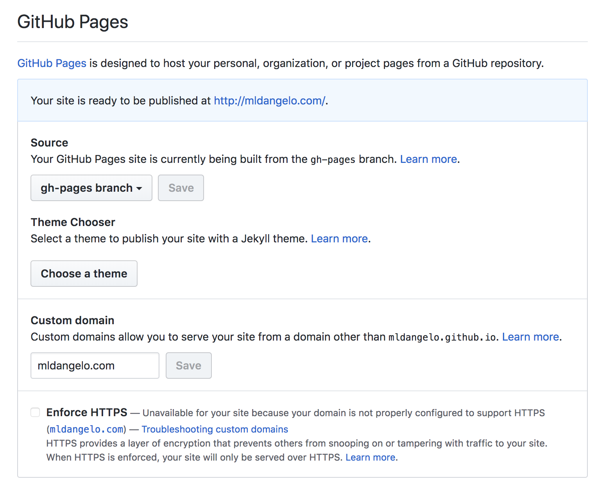

# yinhaohe.tech and simplified

#  https://yinhaohe.github.io/Yinhao-personal-site/

My personal website. Easily modifiable, and built using modern javascript with Node.js, React, Express, React-Router, Hot Module Reloading, Webpack and many other technologies.

## A note on adapting this repository to your own personal website

## Dependencies USE NODE 12 !!

Tested with:

- node >= v8, v9, v10, v11, v12
- Recommend [nvm](https://github.com/creationix/nvm#installation) for managing node versions

## Set up

You may wish to fork this repository or remove my remote origin and add your own. Go [here](https://help.github.com/articles/changing-a-remote-s-url/) for more information on changing remotes.

1. To download the repository and install dependencies, run the following commands:

   ```bash
   git clone git://github.com/mldHe/personal-site.git
   cd personal-site
   npm install
   ```

   If you do not have `yarn` installed, you may run `npm install` instead.

2. Next, you should create a `.env` file. To do this, run:

   ```bash
   cp sample.env .env
   ```

   and set values as appropriate. Most people will not need to make changes.

3. Run the following command to build the react application and serve it with hot module reloading:

   ```bash
   npm run dev
   ```

   Navigate to `<ip>:<port>` default: [http://localhost:7999](http://localhost:7999) to view my website.

   This completes set up instructions. Please continue reading to learn how to modify this site to make it your own.

## Checklist

1. Start by changing text in the sidebar. This file is located at `app/components/Template/Nav.js`.
2. Add an image of yourself in `public/images/me_icon.jpg`. If you decide to change the filename, be sure to go back to the sidebar and change the image path there as well.
3. Modify the text in `app/views/Index.js`
4. Modify the files in `app/data/resume/` next. When you're finished, go back and modify all of the other files in the `app/data/` directory.
5. You've finished modifying >95% of the pages. Search through the rest of the files for references to `Michael` or `He` and change values to your name.
6. Change the description in `server/views/index.tpl.html`. You may also wish to add a new favicon or remove it. [This](https://realfavicongenerator.net/) website may be helpful.
7. Decide how and where you are going to host this project. I recommend purchasing your own domain name from [Google Domains](https://domains.google). If you would like to host on github pages, run `npm run deploy`. This will generate a new branch called `gh-pages`. Then go to `https://github.com/[your github username]/personal-site/settings` and configure accordingly:

   

8. Configure your domains DNS record. See [here](https://help.github.com/articles/using-a-custom-domain-with-github-pages/) for more information.
9. Change `homepage` in `package.json` to reflect where you plan to host the site. This is important for react-snap. If using a custom url, modify the [CNAME](/public/CNAME) file to point to your URL. If you plan to deploy to a /[path]
   (e.g. https://yinhaohe.github.io/Yinhao-personal-site/), you should modify `BASE_PATH` in your `.env` and `sample.env` files and restart the express server. Note that you will now have to navigate to `localhost:[port]/[BASE_PATH]` when developing.

## Deploying to Github Pages

1. Change `NODE_ENV` to `production` in `.env`
2. Run `npm run deploy`

That's it.

## License

[MIT](https://github.com/mldHe/personal-site/blob/master/LICENSE)
